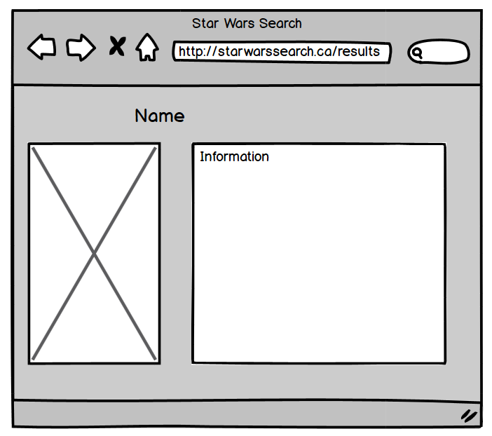

# Star Wars Character Search App

A simple Star Wars character lookup web application, built by my tutee (Aaron) and I as part of my programming tutoring lessons. The goal of this application was to learn the basics of web design and development by building a cool application that can consume an open source API and allow users to search for their favorite star wars characters.

## Mockups

We began the process of designing this application by working on simple low fidelity mockups. We discussed what screens we thought this application would require, and Aaron came up with the following mockups for the various pages of the app.

### Login page

</img>

### Character search page

### Search results page

### No results found page

